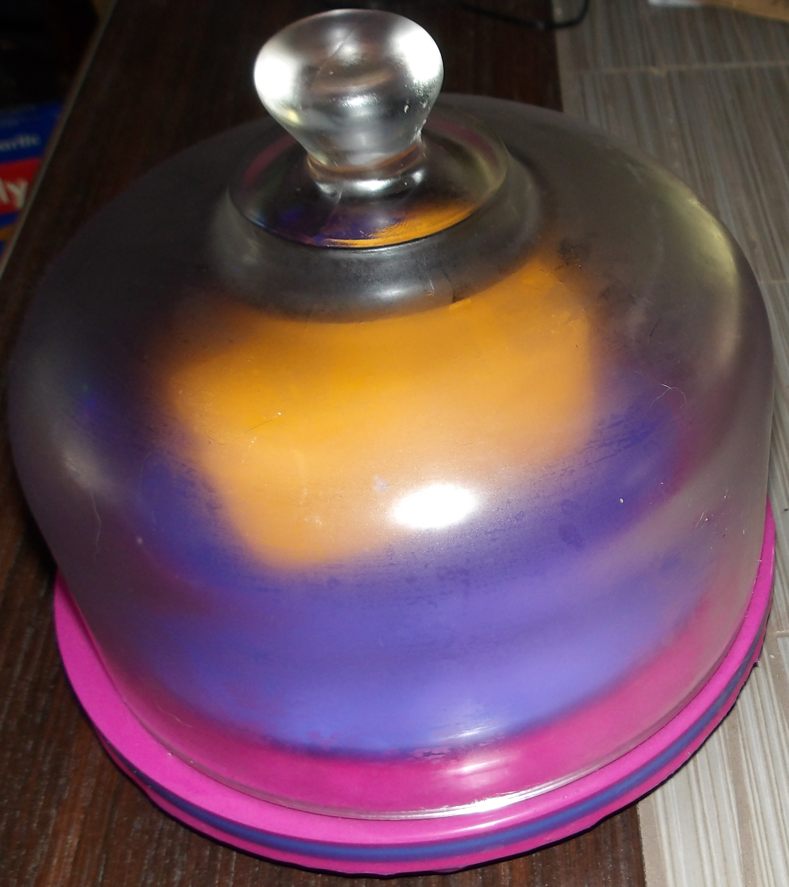

# OpenSCAD Cheese Dish

This is for making a glass covered cheese dish base, like below.

# Directions

`vars.scad' contains the variables that control the build. All values are in mm.

| var                     | description                                                                                           |
|-------------------------|-------------------------------------------------------------------------------------------------------|
| `height`                | The total height of the base plate, not including feet.                                               |
| `diameter`              | Diameter of the plate.                                                                                |
| `recess_height`         | The size of the recess.                                                                               |
| `recess_inner_diameter` | Inner diameter of where recess starts.                                                                |
| `recess_outer_diameter` | Outer diameter of where the recess ends. If this is smaller than the diameter it there will be a lip. |
| `feet_size`             | How high the feet should be.                                                                          |

You will likely want to make `recess_outer_diameter` wider than the diameter. Having a lip
that the dish sits into will make covering it in epoxy to seal it a lot harder. Also makes
it more annoting to clean.

I personally like using 8 feet. I find it makes it nice and stable.

After printing it and glueing the feet in place, you will want to cover the top in food
safe epoxy to seal the surface. I suggest [ArtResin](https://www.artresin.com/) for that.
